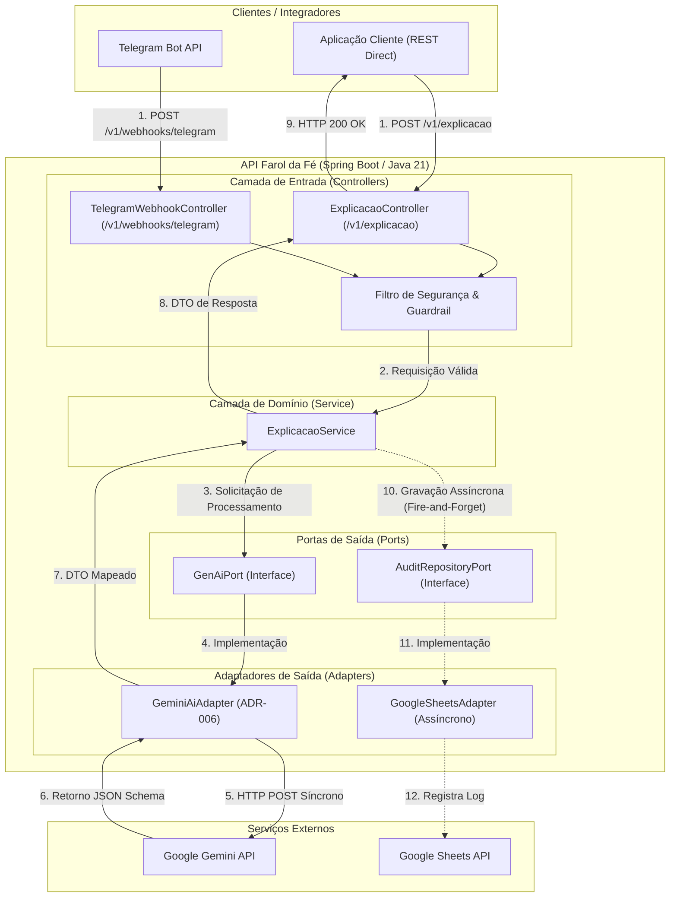
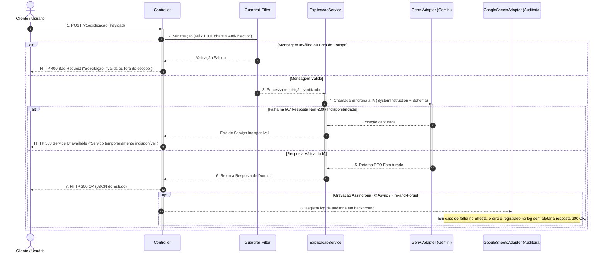

# API Farol da Fé — Arquitetura de Software

## 1. Visão Geral
Este documento descreve a arquitetura da **API Farol da Fé**, projetada como uma **Ferramenta de Apoio a Estudos Bíblicos Guiados e Exegéticos**. O objetivo do sistema é fornecer análises de textos e temas bíblicos com contexto histórico e aplicação prática.

O fluxo de dados da aplicação ocorre da seguinte forma:
1. Recebimento da requisição enviada por uma aplicação cliente (API REST) ou por integradores (bot do Telegram).
2. Sanitização e validação prévia dos dados de entrada.
3. Processamento síncrono da solicitação junto ao provedor de IA Generativa (Google Gemini).
4. Retorno da resposta estruturada ao cliente.
5. Gravação assíncrona da interação em segundo plano para fins de auditoria e curadoria.

---

## 2. Estrutura da Aplicação (1 Microserviço Modular)

### 2.1 Decisão Arquitetural: Monolito Modular
Foi definida a implementação da aplicação como **1 único microserviço modular**, em detrimento de uma arquitetura distribuída em múltiplos microserviços. 

Essa decisão baseia-se nos seguintes fatores:
* **Eficiência de Infraestrutura e Custos:** Operação simplificada na camada gratuita (*Free Tier*) de plataformas Serverless (como Google Cloud Run ou Render), reduzindo impactos de *cold start* e otimizando o consumo de CPU e memória (ADR-004).
* **Baixa Latência:** Eliminação de chamadas de rede internas entre serviços, reduzindo o tempo de resposta final.
* **Simplicidade Operacional:** Centralização de compilação, testes e implantação em um único artefato.

### 2.2 Desacoplamento via Arquitetura Hexagonal (Ports & Adapters)
A separação de responsabilidades é mantida através do padrão de Arquitetura Hexagonal:
* **Camada de IA:** A regra de negócio interage exclusivamente com a interface `GenAiPort`. A implementação inicial utiliza o `GeminiAiAdapter` (ADR-006). Essa abstração permite a substituição do provedor de IA (ex: OpenAI) sem alterações na camada de domínio.
* **Camada de Auditoria e Persistência:** A gravação de interações é realizada através da interface `AuditRepositoryPort`. No MVP, é utilizado o `GoogleSheetsAdapter`. A migração futura para um banco de dados relacional ou NoSQL (ex: MongoDB ou PostgreSQL) exige apenas a criação de um novo adaptador.

---

## 3. Endpoints da API (Contratos REST)

### 3.1 Endpoint Principal do MVP: `POST /v1/explicacao`
Endpoint REST para solicitação de explicação e exegese de um texto ou tema bíblico.

**Payload de Entrada (JSON):**
```json
{
  "texto_ou_tema": "Qual o contexto histórico e a aplicação exegética de Filipenses 4:13?",
  "usuario_id": "123456"
}
```

**Payload de Saída (HTTP 200 OK):**
```json
{
  "referencia": "Filipenses 4:13",
  "contexto_historico": "Escrito pelo apóstolo Paulo enquanto estava prisioneiro em Roma...",
  "analise_texto": "No grego original, o verbo indica capacitação para enfrentar qualquer situação...",
  "aplicacao_pratica": "Aprender a ter contentamento tanto em momentos de necessidade quanto de fartura."
}
```

> **Nota de Extensibilidade:** Endpoints futuros como `POST /v1/devocional` e `POST /v1/sermao` reutilizarão a mesma estrutura arquitetural.

---

### 3.2 Endpoint de Integração (Telegram): `POST /v1/webhooks/telegram`
Endpoint responsável por receber as notificações enviadas pela API de Webhook do Telegram.

**Descrição dos Campos do Envelope:**
* `update_id`: Identificador único da notificação gerado pelo protocolo do Telegram.
* `message.message_id`: Identificador sequencial da mensagem dentro do chat.
* `message.from.id`: Identificador do usuário no Telegram (utilizado para Rate Limiting).
* `message.chat.id`: Identificador do chat para envio da resposta.

**Payload do Webhook:**
```json
{
  "update_id": 987654321,
  "message": {
    "message_id": 42,
    "from": {
      "id": 123456,
      "first_name": "Usuario"
    },
    "chat": {
      "id": 987654
    },
    "text": "/explicar Filipenses 4:13"
  }
}
```

---

## 4. Comunicação com a IA (GenAI)

### 4.1 Natureza da Comunicação: Síncrona
A comunicação com a API do Google Gemini (ADR-006) é realizada via chamadas **HTTP POST síncronas**.
* **Ausência de Polling:** A resposta é retornada diretamente no corpo da resposta HTTP, dispensando verificações periódicas de status (`GET /status`).
* **Uso de Virtual Threads (Java 21):** O tempo de espera da resposta do modelo de IA é gerenciado por Virtual Threads (ADR-001). A thread do sistema operacional permanece liberada durante o bloqueio de I/O, otimizando a concorrência e o uso de CPU.

### 4.2 Recursos do Provedor de IA
* **System Instruction (`system_instruction`):** Instruções de sistema enviadas em canal isolado para delimitar o papel do modelo, manter o escopo teológico e aplicar diretrizes de conduta.
* **Structured Output (JSON Schema):** Imposição de esquema JSON na requisição, garantindo que o modelo responda estritamente no formato tipado definido pelo contrato da aplicação.

---

## 5. Resiliência, Segurança e Tratamento de Exceções

### 5.1 Defesa e Sanitização (Guardrail)
* **Limite de Tamanho:** A entrada do usuário é limitada a no máximo **1.000 caracteres**, permitindo perguntas mais detalhadas ou citação de trechos sem comprometer a segurança.
* **Proteção Anti-Prompt Injection:** Sanitização via expressões regulares para bloquear padrões conhecidos de *jailbreak* (ex: *"ignore as instruções anteriores"*).
* **Filtro de Escopo:** Rejeição imediata de mensagens fora do escopo bíblico/teológico antes do acionamento da IA.

### 5.2 Controle de Taxa (Rate Limiting)
* Aplicação do limite de **2 requisições por minuto por usuário** (`2 req/min`) através de controle em memória com a biblioteca Bucket4j (ADR-007).

### 5.3 Tratamento de Exceções e Cenários de Falha

1. **Indisponibilidade ou Erro na API de IA (Respostas Non-200 ou Falhas de Rede):**
   * Caso o provedor de IA retorne códigos de erro (HTTP 500, 502, 503) ou ocorra indisponibilidade de rede, a exceção é capturada no adaptador (`GeminiAiAdapter`).
   * A aplicação responde ao cliente com `HTTP 503 Service Unavailable` e uma mensagem tratada: *"O serviço de IA está temporariamente indisponível. Por favor, tente novamente em alguns instantes."*

2. **Timeout na Chamada à IA (> 30 segundos):**
   * Se a chamada para a IA exceder o limite de 30 segundos, a requisição é interrompida via Resilience4j (ADR-007).
   * A aplicação retorna `HTTP 504 Gateway Timeout`.

3. **Inconformidade no JSON Retornado (Schema Mismatch / Parsing Error):**
   * Caso a IA retorne uma estrutura desalinhada com o esquema JSON configurado, a falha de desserialização é interceptada.
   * A aplicação retorna `HTTP 500 Internal Server Error` com fallback amigável: *"Não foi possível estruturar a resposta do estudo. Por favor, reformule a pergunta."*

4. **Falha na Gravação Assíncrona de Auditoria (Google Sheets Offline / Indisponível):**
   * Como a gravação ocorre de forma não-bloqueante (`@Async` / *fire-and-forget*), qualquer falha na integração com o Google Sheets é registrada nos logs da aplicação para monitoramento, **sem interromper ou afetar o retorno da resposta ao usuário**.

---

## 6. Diagramas Arquiteturais (Mermaid)

### 6.1 Diagrama de Componentes



---

### 6.2 Diagrama de Sequência (Fluxo Principal e Tratamento de Falhas)


