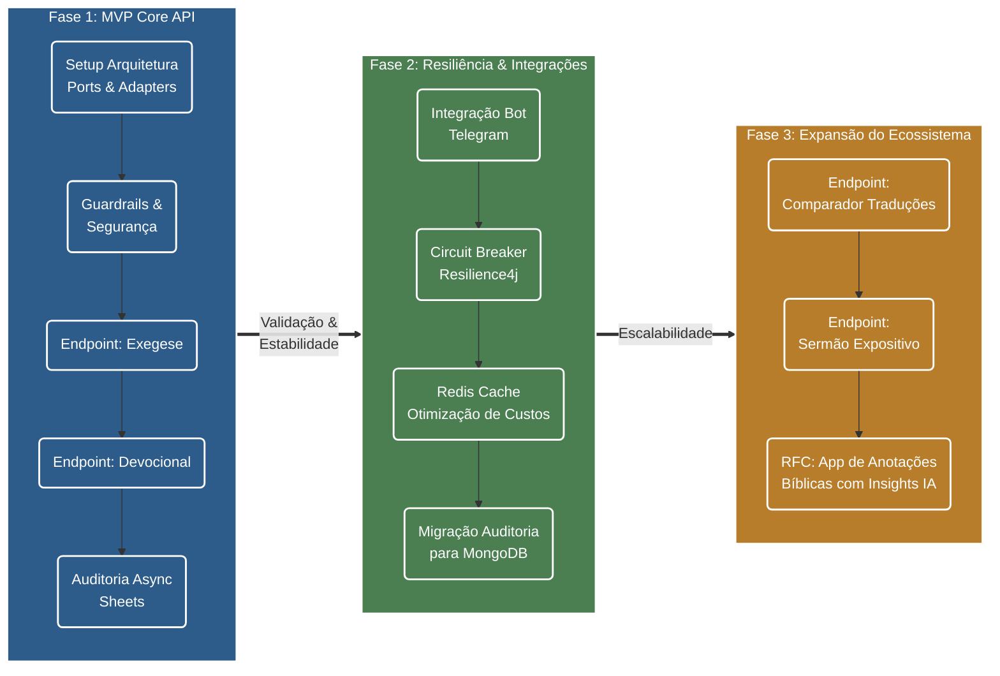

# PRD 001 — Farol da Fé
**Ferramenta de Apoio a Estudos Bíblicos Exegéticos e Devocionais**

**Status:** Draft / Em refinamento  
**Data:** 2026-07-22  
**Autor:** Felipe Souza  
**Tipo de Documento:** Product Requirements Document (PRD)  

---

## 1. Propósito e Visão

### O Problema
Cristãos leigos, líderes de pequenos grupos e estudantes da Bíblia frequentemente encontram dificuldades para realizar estudos exegéticos profundos (compreendendo contexto histórico, idioma original, público-alvo e aplicação). Ao utilizarem ferramentas genéricas de Inteligência Artificial (como o ChatGPT padrão), ficam expostos a respostas teologicamente imprecisas, enviesadas, liberais ou desvinculadas da ortodoxia cristã histórica.

### A Proposta de Valor
O **Farol da Fé** é uma API focada em apoiar o estudo bíblico e a meditação devocional. Através de "guardrails" de segurança e prompts teologicamente alinhados à fé protestante histórica, a ferramenta atua como um assistente confiável. Ela entrega conteúdo estruturado, reverente e aplicável, sem jamais pretender substituir a leitura direta das Escrituras, a comunhão local ou o aconselhamento pastoral.

---

## 2. Público-Alvo (User Personas)

1. **O Estudante Dedicado:** Cristão que deseja se aprofundar na Palavra, entender o contexto das passagens e encontrar correlações bíblicas consistentes para seu crescimento espiritual.
2. **O Líder de Estudo / Célula:** Precisa de apoio rápido e confiável para estruturar estudos bíblicos, extrair aplicações práticas e evitar heresias ou interpretações rasas ao ensinar outras pessoas.
3. **O Pregador Leigo / Pastor (Fase 3):** Busca insights exegéticos estruturados para iniciar a formulação de esboços expositivos.

---

## 3. Escopo do Produto

### 3.1. O que ENTRA no MVP (Fase 1)
O Minimum Viable Product foca exclusivamente na construção do motor principal (API) com qualidade de produção.

- **Endpoint de Exegese (`POST /v1/exegese`):** Recebe um texto/tema e retorna contexto, análise textual, referências cruzadas e aplicação prática.
- **Endpoint de Devocional (`POST /v1/devocional`):** Recebe um tema e retorna um devocional completo (título, texto-chave, reflexão expositiva, aplicação e oração).
- **Mecanismos de Segurança (Guardrails):** Filtro anti-prompt injection e limitação de caracteres na entrada.
- **Auditoria Básica:** Registro assíncrono das interações em planilha do Google Sheets (fire-and-forget) para curadoria de qualidade.
- **Resiliência Básica:** Rate limiting simples em memória e timeout.

### 3.2. Fora de Escopo do MVP (Out of Scope)
Para garantir a entrega rápida e focada, os seguintes itens **NÃO** fazem parte do MVP e serão priorizados no futuro:

- App Mobile, Web Frontend ou Interface Gráfica de Usuário (GUI).
- Integração direta com Telegram ou WhatsApp (a API será agnóstica nesta primeira fase).
- Banco de dados complexo para histórico de usuários (MongoDB, PostgreSQL).
- Sistema de cache com Redis (respostas serão geradas sob demanda).
- Autenticação complexa (OAuth2/JWT) de usuários finais.
- App de Anotações Bíblicas (ideia validada como futuro RFC).

---

## 4. Métricas de Sucesso

Como saberemos que o MVP foi bem-sucedido tecnicamente e conceitualmente?

* **Qualidade Teológica:** 100% de conformidade nas auditorias de curadoria (respostas alinhadas aos princípios definidos nos prompts, sem alucinações hereges).
* **Performance (SLO):** p95 da latência das requisições abaixo de 10 segundos (considerando as limitações do provedor de IA e free tier).
* **Confiabilidade:** Taxa de erro (HTTP 5xx) menor que 1%.
* **Custos:** Manutenção da infraestrutura operando a um custo próximo a R$ 0,00 (Free Tier GCP/Render e Gemini API).

---

## 5. Premissas e Restrições

* **Premissa Teológica:** A IA será rigidamente instruída por *System Instructions* para atuar sob uma persona específica e rejeitar qualquer instrução que tente burlar esse papel.
* **Restrição Legal e Ética:** A API deve sempre incluir um disclaimer em suas respostas (ex: *"Não substitui a leitura direta da Bíblia..."*), respeitando os termos de uso e o licenciamento não-comercial (CC BY-NC-SA 4.0).
* **Restrição Técnica:** O desenvolvimento deve ser otimizado para cenários I/O-bound (uso de Virtual Threads do Java 21) para suportar a latência natural dos modelos de IA generativa.

---

## 6. Roadmap de Entregas (Caminho do Produto)

O gráfico abaixo ilustra a esteira de evolução do produto, partindo da fundação da API (MVP) até a expansão para novos produtos do ecossistema.

